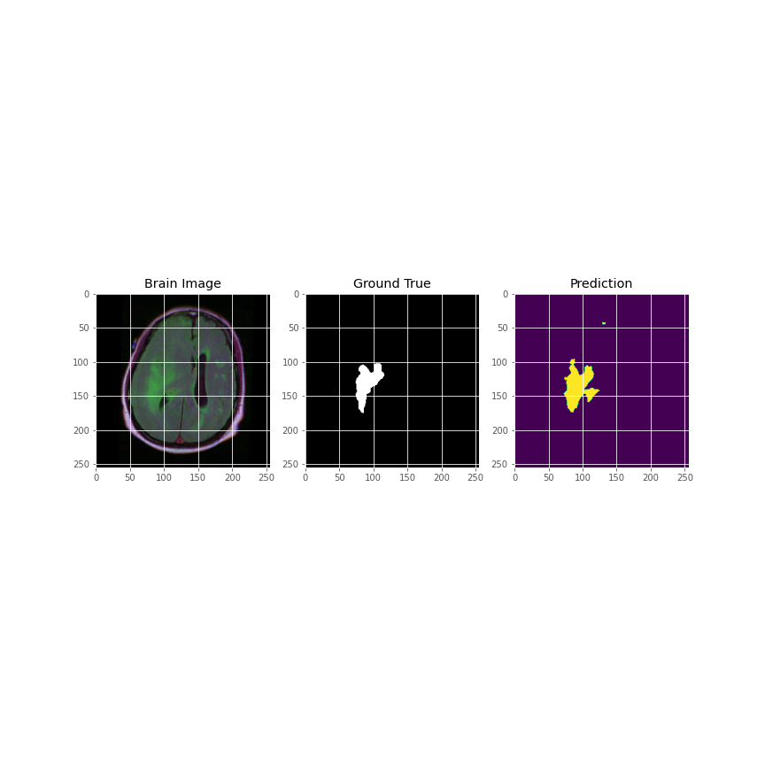

# Retina Blood Vessel Segmentation using UNET in PyTorch

This repository contains the code for semantic segmentation of the retina blood vessel on the DRIVE dataset using UNET architecture in PyTorch framework.
   

# Overview
- Architecture
- Checkpoint
- Results

# Architecture
The block diagram of the UNET architecture taken from the original paper.

|  |
| :--: |
| *U-Net Architecture* |

# Results
The images below contains:
1. Input image
2. Ground truth 
3. Predicted mask

|  |

